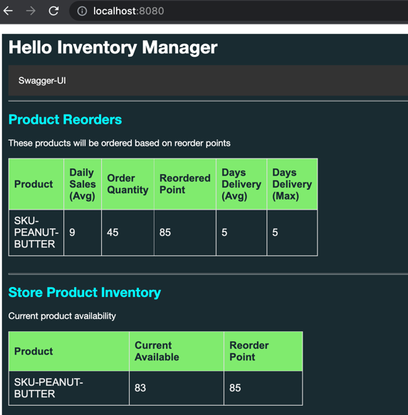

Starting GemFire

Open Gfsh

```shell
export GEMFIRE_HOME=/Users/devtools/repositories/IMDG/gemfire/vmware-gemfire-9.15.3
cd $GEMFIRE_HOME/bin
./gfsh
```

Start Locator

```shell
start locator --name=locator1 --bind-address=127.0.0.1 --hostname-for-clients=127.0.0.1  --jmx-manager-hostname-for-clients=127.0.0.1 --http-service-bind-address=127.0.0.1 
```

PDX

```shell
configure pdx --disk-store --read-serialized=true

```

Start Server

```shell
start server --name=server1 --server-port=40404  --locators=127.0.0.1[10334]  --bind-address=127.0.0.1 --hostname-for-clients=127.0.0.1  --jmx-manager-hostname-for-clients=127.0.0.1 --http-service-bind-address=127.0.0.1
```

Create Regions

```shell
run --file=/Users/Projects/VMware/Tanzu/Use-Cases/Vertical-Industries/VMware-Retail/dev/vmware-retail-inventory-showcase/deployments/repositories/gemfire/create_regions.gfsh
```


## User Interface



# Submit Transaction Testing


Exchange: retail.transaction

contentType = application/json

```json
{
  "storeId": "001",
  "registerId": "LANE1",
  "total": 3.3,
  "itemId": "SKU-PEANUT-BUTTER"
}
```

With Timestamp

```json
{
  "storeId":"001",
  "registerId":"LANE1",
  "total": 3.33,
  "itemId":"SKU-PEANUT-BUTTER",
  "timestamp":"2023-01-17T10:36:54.82721"
}
```

```json
{
  "storeId":"001",
  "registerId":"LANE1",
  "total": 3.33,
  "itemId":"SKU-PEANUT-BUTTER",
  "timestamp":"2023-01-16T10:36:54.82721"
}
```


# Update StoreProductInventory Testing

Exchange: retail.storeProductInventory

```json
{
  "id": "SKU-PEANUT-BUTTER|001",
  "productId": "SKU-PEANUT-BUTTER",
  "storeId": "001",
  "currentAvailable": 10
}
```


```json
{
  "id": "SKU-PEANUT-BUTTER|001",
  "productId": "SKU-PEANUT-BUTTER",
  "storeId": "001",
  "currentAvailable": 50
}
```

--------------------

# Prediction Models


Exchange: retail.productModelPrediction


```json
{
  "id":"SKU-PEANUT-BUTTER|001",
  "storeId":"001",
  "productId":"SKU-PEANUT-BUTTER",
  "averageDailySales":9,
  "averageDailyOrders":3,
  "averageLeadTimeDays":5,
  "maxDailyOrders":3,
  "maxLeadTimeDays":5,
  "maxDailySales":12
}
```


----------------

```graphql
query {
    products(count: 10, offset: 0) {
        name,
    id,
    price,
    directions,
    nutrition {
      totalFatAmount
      cholesterol
      sodium
      totalCarbohydrate
      sugars
      protein
      calories
    }
    }
}
# query {
#     queryProducts(query: "id like '%'") {
#         name,
#     details
        
#     }
# }
# mutation SaveProduct ($product: Product) {
#   saveProduct(product: $Product) {
#     Product {
#       id : id,
#       name : name
#     }
#   }
# }
# input ProductInput {
#     id: String!
#     name: String!
#     price: Float
#     details: String
#     ingredients: String
#     directions: String
#     warnings: String
#     quantityAmount: String
# }

# input NutritionInput {
#     totalFatAmount: Int
#     cholesterol: Int
#     sodium: Int
#     totalCarbohydrate: Int
#     sugars: Int
#     protein: Int
#     calories: Int
# }

# mutation SaveProduct ($id: String!, $name: String!, $price: Float, $details: String, $ingredients: String, $directions: String, $warnings: String, $quantityAmount: String) {
#     saveProduct(id: $id, name: $name,price: $price,
#         details : $details,
#         ingredients : $ingredients,
#         directions : $directions,
#         warnings : $warnings,
#         quantityAmount : $quantityAmount
#     ) {
#         id : id,
#         name : name,
#         price : price,
#         details : details,
#         ingredients : ingredients,
#         directions : directions,
#         warnings : warnings,
#         quantityAmount : quantityAmount
#     }
# }
# mutation SaveProduct ($id: String!, $name: String!, $price: Float, $details: String, $ingredients: String, $directions: String, $warnings: String, 
#     $quantityAmount: String, $totalFatAmount: Int,
#     $cholesterol: Int, $sodium: Int,
#     $totalCarbohydrate: Int, $sugars: Int, $protein: Int,
#     $calories: Int) {
#     saveProduct(id: $id, 
#         name: $name,
#         price: $price,
#         details : $details,
#         ingredients : $ingredients,
#         directions : $directions,
#         warnings : $warnings,
#         quantityAmount : $quantityAmount,
#         totalFatAmount: $totalFatAmount,
#         cholesterol: $cholesterol,
#         sodium: $sodium,
#         totalCarbohydrate: $totalCarbohydrate,
#         sugars: $sugars,
#         protein: $protein,
#         calories: $calories) {
#         id : id,
#         name : name,
#         price : price,
#         details : details,
#         ingredients : ingredients,
#         directions : directions,
#         warnings : warnings,
#         quantityAmount : quantityAmount
#     }
# }

```